<div align="center">

<h3><code>saptarshi@github ~ $ ./contributions.sh</code></h3>

<br><br>
<h3><code>saptarshi@github ~ $ whoami</code></h3>
<table><tr><td valign="top"></td><td valign="top"></td></tr></table>
<br><br>
<h3><code>saptarshi@github ~ $ ./links.sh</code></h3>
<p><b>AI/ML Engineer · Software Systems Builder · Researcher</b></p>

[](https://saptarshi-portfolio-official.netlify.app)
[](https://www.linkedin.com/in/saptarshi-mondal-a4428b305)
[](https://scholar.google.com/citations?view_op=list_works&hl=en&hl=en&user=eNhrp9gAAAAJ)
[](https://orcid.org/0009-0003-4511-7827)
[](https://leetcode.com/u/Saptarshi_Mondal_2025/)
[](https://github.com/Sap1x)
</div>

---
<h3><code>saptarshi@github ~ $ cat about.md</code></h3>

Final-year Computer Science Engineering student and **Meta OpenEnv Hackathon Grand Finalist (Top 0.02% in India)** focused on scalable software systems, AI-driven applications, and distributed backend architectures.

I work across **Python, Java, PyTorch, TensorFlow, FastAPI, cloud infrastructure, and system design**, with an engineering focus on performance, scalability, reliability, and production-grade systems.

---
<h3><code>saptarshi@github ~ $ cat education.txt</code></h3>

**Adamas University — Kolkata, India**  
B.Tech in Computer Science and Engineering (AI & ML) · **2023–2027** · Expected graduation **06/2027**  
Current CGPA: **7.89 / 10**

---
<h3><code>saptarshi@github ~ $ cat stack.json</code></h3>

| Domain | Technologies |
|---|---|
| Languages | Python · C++ · C · SQL |
| Backend & APIs | Node.js · Express.js · FastAPI · REST APIs · WebSockets · WebRTC |
| Frontend | Next.js · HTML5 · CSS3 |
| Cloud & Containers | Docker · CI/CD · AWS · Azure |
| Data & Messaging | PostgreSQL · MongoDB · Supabase · Firebase · Redis · CDNs |
| AI/ML & Systems | PyTorch · TensorFlow · Hugging Face Transformers · Multi-Agent Systems · RL (GRPO/PPO) · RAG · Vector Databases · LangChain [Smith/Fleet] · Federated Learning · Real-time Systems · OAuth 2.0 · DSA · OOP |

---
<h3><code>saptarshi@github ~ $ cat experience.log</code></h3>

### Software Engineering Research Intern — IIT Kharagpur
**Department of Aerospace Engineering · Jun 2026 – Aug 2026 · Hybrid**

- Built a scalable event-driven **Edge–Cloud IoDT architecture** using EventBus/Observer Pattern, orchestrating IoT sensors, UAV missions, edge inference, cloud analytics, and real-time Digital Twin synchronization.
- Designed a loosely coupled hybrid edge–cloud pipeline across **LoRaWAN, MQTT, Wi-Fi, 5G, and FANET**, enabling distributed processing and independent component scaling.
- Achieved **100% field coverage, 32.54 ms average end-to-end latency, and 97% mission reliability** through Python-based simulation and end-to-end performance evaluation.

---
<h3><code>saptarshi@github ~ $ ls ./projects</code></h3>

### `CodeRL++/` — Self-Improving Agentic Code Review RL Environment
**Meta Hackathon Finalist** · [Source](https://github.com/Sap1x/CodeRL-)

`Python` `FastAPI` `PyTorch` `Hugging Face` `GRPO` `Unsloth` `Docker` `Redis` `Qwen2.5` `Llama 3`

- Built and deployed an **OpenEnv-compliant RL environment** for autonomous LLM-based code review, enabling agents to detect, fix, and validate issues through multi-stage reasoning.
- Developed a self-improving RL pipeline with **cross-episode memory and composite rewards**, improving recall by **138%**, critical bug detection by **188%**, and reducing false positives by **57%** over **3K+ GRPO steps**.
- Engineered a **FastAPI + Redis + Docker** production system delivering real-time inference at approximately **1.2s latency** with automated evaluation pipelines.

### `UrbanFlow-OPS/` — AI Traffic Operations & Digital Twin Platform
**Flipkart GRiD 2.0 Semi-Finalist** · [Source](https://github.com/Sap1x/UrbanFlow-AI)

`XGBoost` `Random Forest` `SHAP` `SciPy` `NetworkX` `Digital Twin` `GIS` `Event-Driven Microservices`

- Built an AI traffic intelligence platform using **90K+ Bengaluru traffic records**, leveraging XGBoost, Random Forest, and SHAP for explainable congestion prediction.
- Architected an **event-driven microservices backend** with FastAPI/WebSockets, Digital Twin simulation, and SciPy/NetworkX optimization for **1000+ simultaneous incidents**.
- Delivered **sub-100ms ML inference** and automated resource optimization, achieving **94.3% simulated cost savings**.

---
<h3><code>saptarshi@github ~ $ cat publications.bib</code></h3>

- **S. Das, B. Pradhan, S. Mondal, S. Halder, S. Gupta.** *Enhancing Object Identification Using Deep Learning Algorithms for Assisting Disabled Individuals.* Lecture Notes in Networks and Systems, Springer, 2025. [Springer](https://link.springer.com/chapter/10.1007/978-981-96-5822-0_17)
- **S. Mondal, S. Das, S. Halder.** *Integrating Deep Learning-Based Object Detection into Assistive Systems for Dynamic Accessibility Challenges.* IEEE SISIMPACT International Conference, 2025. [IEEE Xplore](https://ieeexplore.ieee.org/document/11439520)

---
<h3><code>saptarshi@github ~ $ cat achievements.log</code></h3>

- 🏆 **Meta OpenEnv Hackathon Grand Finalist — Top 0.02% in India**; competed in the 48-hour Grand Finale in Bangalore building scalable AI systems alongside engineers from top tech companies.
- 🏆 **Flipkart GRiD 2.0 Semi-Finalist** with UrbanFlow OPS.
- 🥇 **7th rank** in the Data Structures & Algorithms Competition, CAPE Laboratory, IIT Kharagpur (2025).
- ☁️ **Oracle Cloud Infrastructure 2025 Certified Developer Professional** — Credential ID `102958533OCID25CP`. [Credential](https://catalog-education.oracle.com/pls/certview/sharebadge?id=95BCBF1053D9A7D951FF8525B8FB8A7E71D639A647812AB12EB4853AC352A2F5)
- 🤖 **AWS Academy Graduate — Generative AI Foundations**. [Credential](https://www.credly.com/badges/0678a8a1-1cb4-4cd6-a1e3-a317b2ff2aaa)

---
<h3><code>saptarshi@github ~ $ ./system-status.sh</code></h3>

```text
STATUS      : BUILDING
FOCUS       : Scalable AI systems + distributed backend architecture
RESEARCH    : Edge–Cloud IoDT · AI/ML · Reinforcement Learning
ENGINEERING : Production systems · APIs · Real-time infrastructure
LOCATION    : Kolkata, India
GRADUATION  : June 2027
```

> The contribution heatmap and statistics are generated from GitHub's public contribution calendar and refreshed automatically by GitHub Actions. GitHub profile README repositories must match the account username and be public for the README to render at the top of the profile.
